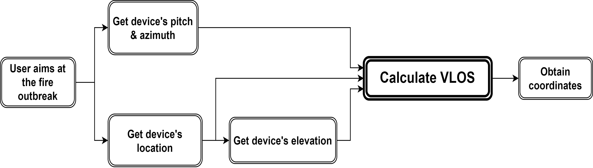
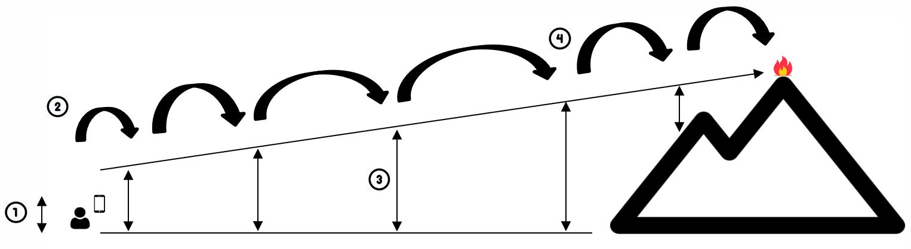
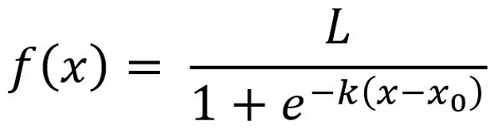

# GeoLocate
Geolocate a wildfire leveraging smartphone built-in sensors and a DEM.

## Description
* The early identification of a wildfire outbreak can significantly accelerate firefighting maneuvers leading to its rapid extinction.
* This repo presents a method developed for geolocating wildfires leveraging smartphone sensors;
* The app’s backend was developed on top of the ArcGIS ecosystem to facilitate the adoption of this tool and to better integrate with the existing technological infrastructure
* Nevertheless, the geolocating algorithm does not depend on this ecosystem. This work is intended to use smartphones for accurately geolocating wildfire outbreaks.
* This tool was developed in the scope of my PhD work whose goals are to develop multiple tools for supporting decision-making in the wildfire context.

## Overview
### Algorithm


An app was developed to geolocate wildfire outbreaks. The user aims the smartphone’s camera at the fire outbreak and takes a picture. The GPS location, the device’s pitch and azimuth and the device’s elevation (through a DEM) are retrieved from the smartphone’s built-in sensors. These data is used to calculate the user’s visual line-of-sight (VLOS). A diagram is provided that explains the algorithm developed to calculate the VLOS.


<div style="text-align: center;">
  
</div>

1. Consider the smartphone’s initial height (the sum of the elevation retrieved from the DEM and the smartphone’s height relative to the ground, inputted in the app Settings page).
2. Take an initial step (based on the smartphone’s height).
3. Calculate the step size based on the height difference from the viewray to the ground, using a custom logistic function (with 𝐿=15, 𝑘=0.9, 𝑥0=6).

<div style="text-align: center;">
  
</div>


4. Step through the line-of-sight to the fire outbreak.

### Results

* An app has been developed to geolocate wildfire outbreaks using the sensors on a smartphone;
* A distance error of between 2.8 - 5.4% was obtained;
* The application was developed with the ArcGIS Runtime SDK for Android.


### Run the sample

* Clone the project from the repository
* Download the DEM:
    1. Download the the DEM ([retrieved from this lpk file](https://hub.arcgis.com/content/d52d4dc61fac482ca95f1369df532d60));
    2. Extract the contents of the downloaded zip file to disk;
    3. Open your command prompt and navigate to the folder where you extracted the contents of the data from step 1;
    4. Execute the command:
    
    ```
    adb push geolocate_dem.tpkx /Android/data/com.example.elevation/files/geolocate_dem.tpkx
    ```
* Change the following contents from the file strings.xml to your credentials taken from the dashboard of your ArcGIS for Developers account:
    ```
    <string name="feature_service">YOUR_ARCGIS_FEATURE_SERVICE_URL"</string>
    <string name="api_key">YOUR_ARCGIS_API_KEY</string>
    ```
* Run the app.
